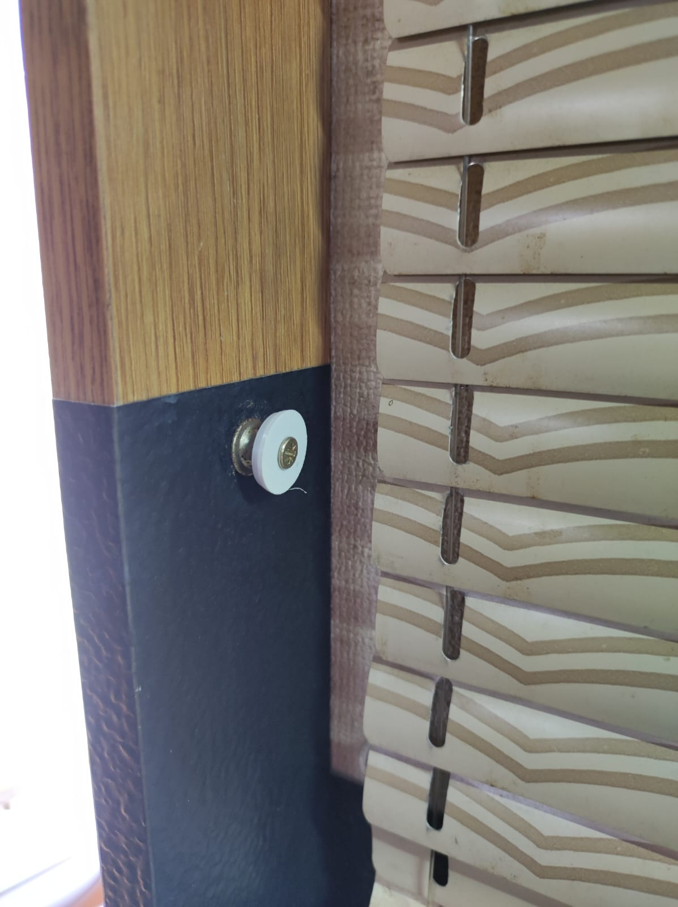
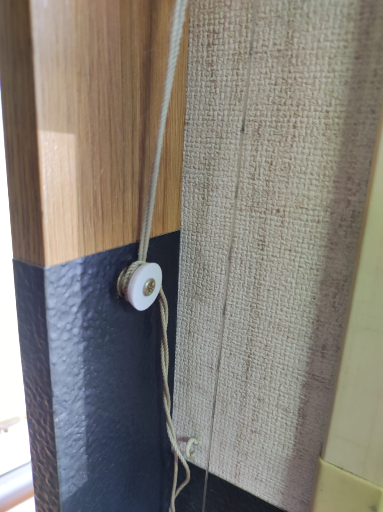
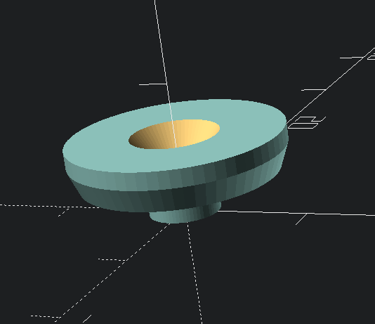

# Window Blind String Lock

Lock the string of a window blind by wrapping it around this locking mechanism.
It's a replica of an original part installed in a motorhome.

Optionally remove the countersink hole for the wood screw by setting
`with_countersink` to `0` and re-exporting.

